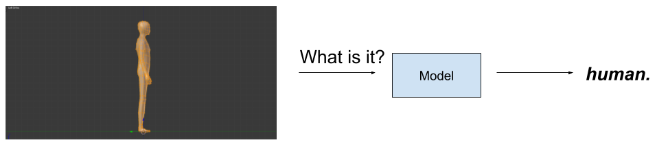
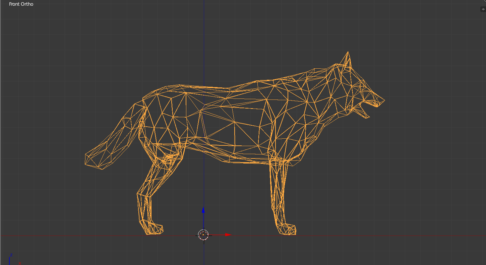
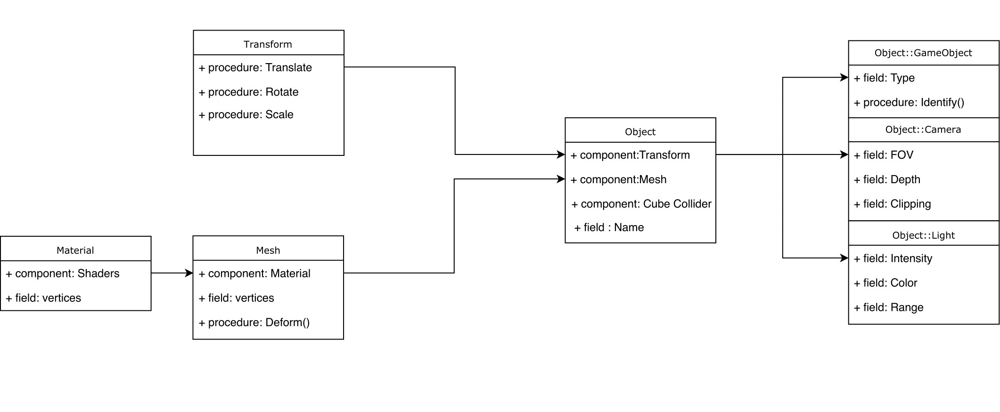
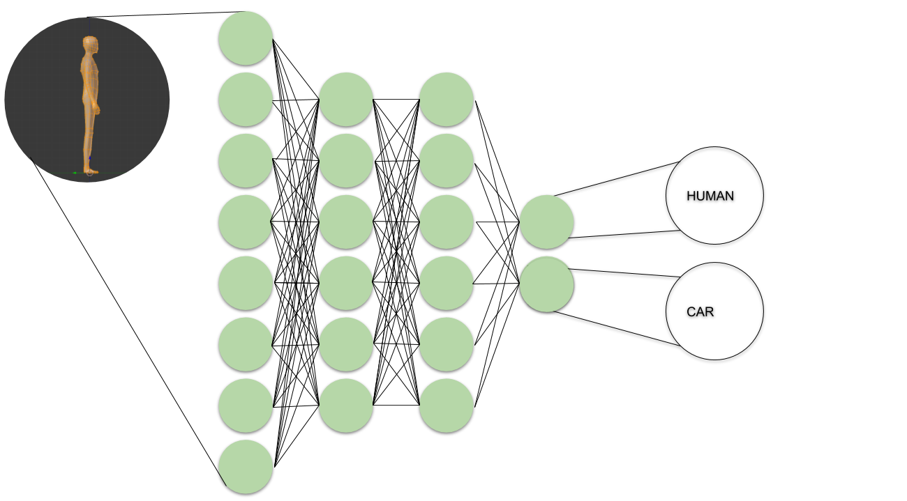

<h2>Project Title : Identifying 3D Objects via Vertex Structure</h2>
Project Members: <a href="https://github.com/furkancaglayan">Furkan Çağlayan</a> & <a href="https://github.com/EmreOzkose">Yunus Emre Özköse</a>

<h3>Introduction </h3>
In this project, we create an application to recognize 3D shapes and distinguish them from one another. Basically, a scene is created of different object types such as humans and cars. In this scene, as objects passing through camera view, they are identified and labeled, again as a human or a car.

 

In detail, project can be divided as computer graphics and learning part. In the graphics part, a scene is created and some models such as human, car, wolf etc. are modeled and placed to the created scene. While creating that scene, a hierarchy is created and the scene is designed according to that hierarchy. In learning part, a machine learning algorithm which is called neural networks is used. Since vertex attributes of the objects are critical for an object, it would be informative. Neural networks are taken flattened vertices as an input and give class probabilities as an output. Features are normalized for handling scaling problem. The main problem in learning is dataset. We handle this problem with procedural mesh generation. This method is used to create a different object of the same type from an object. In this way, many vertex samples are created, flattened and a dataset is created. After that, the designed model is trained and parameters are fine-tuned. 

Scene can be controlled through a user interface system. For example, we can do:
<ul>
    <li> Select, identify or create new deformed objects. </li>
    <li> Change lightning attributes such as intensity and color.</li>
    <li> Change viewing, for example, switch between orthographic or perspective viewing, change a field of view</li>
    <li> Switch between flat and smooth shading models.</li>
</ul>

 

<h3>GUI</h3>
We use a complex user interface so that we can change everything about the scene. Main objectives of the interface are to select objects so we can identify, move and rotate them. Also, we are able to create new procedural meshes through GUI at runtime.

<h3>Scene Features</h3>
We use flat and smooth(Phong model) shading for our project and we will be able to switch between them. Also, camera types include orthographic and perspective viewing. For lightning, we use directional lightning techniques.

<h3>Hierarchy<h3>

<h3>Machine Learning</h3>
The main part of an object is vertices. Hence they are so informative features to utilize them. They consist of coordinates of the objects. A neural network model is designed to classify an object by considering its vertices. Technically, the neural network is fed with flattened vertex matrices. Of course, learning parameters such as the number of hidden layers, size of hidden layer, learning parameters are chosen while experiments are being done. 
    

